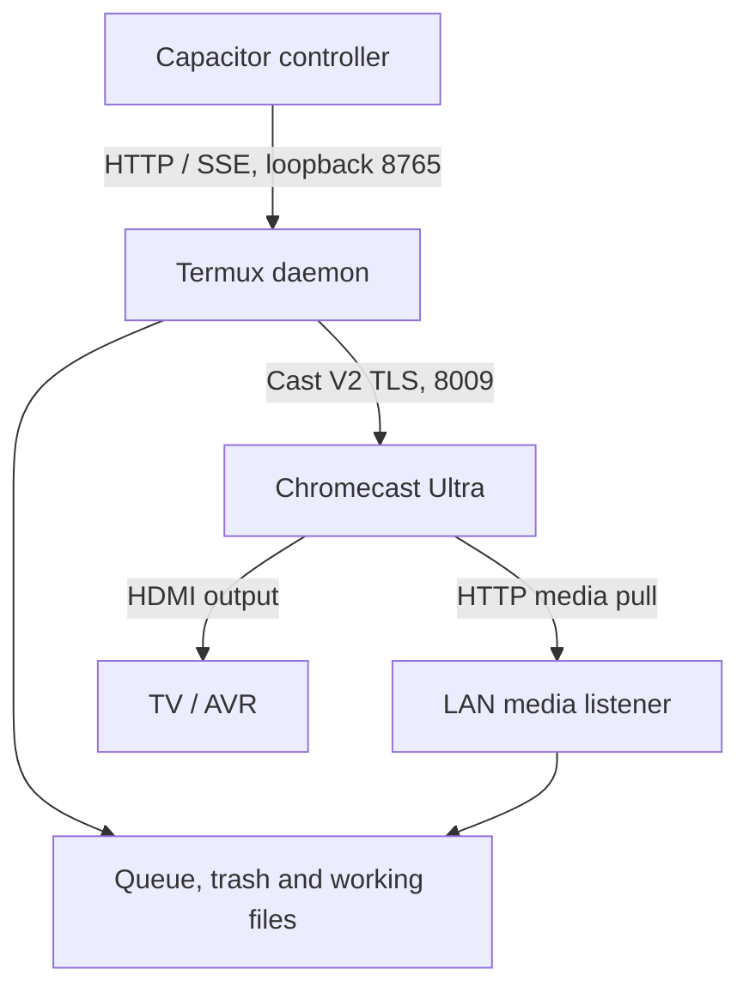

# Chromecast Ultra audit — 6 September 2026

Repository: `1456319/CastCast`. Baseline: [`a754cb5bd9cd8817392f32aba43288a8fe40e61a`](https://github.com/1456319/CastCast/commit/a754cb5bd9cd8817392f32aba43288a8fe40e61a). Proposed fixes are on `codex/ultra-protocol-audit-20260906`.

**Disposition: several confirmed defects are fixed, but this is not yet a release that satisfies the four stated principles.** In particular, strict crash-consistent queue synchronization and proof of 2160p HDMI output remain release gates. The changes should be reviewed and exercised on the rooted Pixel and Ultra before deployment.

This audit covers the production Python daemon and its call paths, HTTP/SSE contracts, React controls, Capacitor plugins, bootstrap, conversion pipeline, bundled receiver, and build packaging. Tests and current primary protocol documentation were checked against the implementation. It does not claim a formal security review of dependencies, authenticated Amazon playback, or a physical device test: no Pixel, Ultra, TV, AVR, provider account, DRM keys, or Android SDK was available in this environment.

## The important architectural distinction

A Cast control connection and the receiver's media download are different paths. A healthy heartbeat does not establish that the media server is delivering bytes fast enough. Conversely, a receiver can continue fetching media after its controller disconnects. This follows the [Cast sender/receiver architecture](https://developers.google.com/cast/docs/overview); it is not evidence that Google Home caused any particular buffering incident.



| Boundary | Required behavior | Audit result |
|---|---|---|
| Cast control | TLS on 8009; platform and application virtual connections are distinct | Baseline already used 8009. No evidence of a 8008/8443 control-port error was found. App identity, state handling and interrupted frames were actual defects. |
| Local control API | Loopback 8765 by default, accessible to the installed Capacitor origin | Restricted Host/Origin checks now preserve `http://localhost`, configured Capacitor/dev origins, and explicit `api_allowed_origins`. Media CORS remains separate. |
| Media download | LAN address reachable from the Ultra; Range, CORS and complete HTTP framing | URLs now distinguish roots and authorize individually issued files. Roaming rebases actual session URLs. |
| Public HTTPS DRM | Tunnel reaches only the license handler | A separate loopback listener now exposes license POSTs. Spoofing Host cannot expose the media handler through that listener. |
| UHD result | Source eligibility, decoded picture and HDMI output must be distinguished | Preflight no longer presents a source prediction as proof of TV output. Actual receiver dimensions are shown when reported. |

## Device constraints used in this audit

The following ceilings come from Google's [supported-media matrix](https://developers.google.com/cast/docs/media). Container changes cannot expand a hardware decoder's profile, level, chroma or frame-rate support.

| Ultra video path | Published ceiling | Consequence |
|---|---|---|
| H.264 High | Level 4.2, 1080p60 | 4K AVC needs a real video encode; remuxing cannot fix it. |
| HEVC Main / Main 10 | Level 5.1, 2160p60 | Prefer a compatible MP4 path. HEVC in MPEG-TS is unsupported. HLS is not inherently MPEG-TS; it may use fragmented MP4. |
| VP9 profiles 0 / 2 | Level 5.1, 2160p60 | Validate the actual profile and bit depth. |
| VP8 | 2160p30 | UHD does not imply 60 fps support. |

4K also requires a compatible HDMI chain, including HDCP 2.2 where required, suitable power, and sufficient throughput. An intervening AVR or soundbar matters. Google's [Ultra HD setup guidance](https://support.google.com/chromecast/answer/7151529?hl=en) is the hardware checklist. A source probe or receiver video width does **not** establish the negotiated HDMI output mode.

`MediaStatus.videoInfo` and its [width/height fields](https://developers.google.com/cast/docs/reference/web_receiver/cast.framework.messages.VideoInformation) can provide receiver evidence. Shaka also publishes video/player statistics. These fields may be absent, delayed, or version-dependent. Absence is now labelled unverified; it is not silently interpreted as 4K success.

## Confirmed defects and changes

P0 means a release blocker under the user's requirements; P1 means a serious functional or security defect; P2 means a narrower correctness or maintainability issue. “Fixed” below means implementation and relevant local regression coverage, not physical-device certification. File references are relative to the repository root.

| ID | Priority | Baseline defect and consequence | Change / status |
|---|---|---|---|
| C01 | P0 | `channel.DEFAULT_MEDIA_RECEIVER_APP_ID` was `07AEE832`, actually the Shaka demo. Native queue commands were sent to an incompatible generic receiver. | **Fixed:** `CC1AD845` for native local queues; Shaka selected for custom-license playback. `channel.py`, `supervisor.py`. |
| C02 | P0 | `_try_load` excluded PLAYING/PAUSED. Replacing current media could be accepted locally without a LOAD being sent. | **Fixed:** active states can load; session selection, send and pending-flag clearing are serialized. |
| C03 | P0 | Restored QUEUE_LOAD reused receiver-assigned `itemId`, lost position and pause state. | **Fixed:** deep-copy and remove IDs, preserve index, `currentTime` and autoplay. New IDs are required by the [QUEUE_LOAD contract](https://developers.google.com/cast/docs/reference/web_receiver/cast.framework.messages.QueueLoadRequestData). |
| C04 | P1 | Any receiver advertising the media namespace could be treated as the desired app, even when it could not consume Shaka DRM configuration. | **Fixed:** exact expected app ID and transport; stale app messages ignored. |
| C05 | P1 | Platform CLOSE and app CLOSE were conflated. Partial TLS frames were discarded after timeout. | **Fixed:** platform close rebuilds the socket; old app close is ignored; buffered header/body survives read timeout. Obsolete `_read_exactly` removed. |
| C06 | P1 | Frequent incoming messages could starve scheduled PINGs. Polling and progress bookkeeping could mask a stall. | **Fixed:** heartbeat budget checked in the main loop, polls also run on timeout, unchanged reported positions do not reset the progress clock, and unconfirmed LOAD has a 45-second failure boundary. This detects failures; it does not prove network throughput. |
| C07 | P1 | Partial MEDIA_STATUS erased subtitle state; queue advance did not consistently update source, title and content URL; empty status retained a session ID. | **Fixed for these cases:** merge optional metadata, update current queue item, clear absent sessions. Full/partial queue-list reconciliation remains R02. |
| C08 | P1 | Native queue completion could invoke the service's unrelated single-item auto-advance path. | **Fixed:** native completion does not replay a different directory/Amazon item. |
| C09 | P1 | No outbound Cast size guard; large queues could fail at the protocol boundary. | **Fixed:** 64 KiB transport guard and 60 KiB queue payload budget. Oversized orders fail visibly. See [media-message limits](https://developers.google.com/cast/docs/media/messages). |
| Q01 | P0 | `will_be_4k` was shown as proof of playback resolution. An UHD manifest request did not prevent ABR selecting 1080p. | **Fixed in reporting/control:** source eligibility is separate; Amazon MPD must contain UHD dimensions; Shaka receives minimum width/height restrictions; reported sub-UHD playback pauses with an error. Missing dimensions and actual HDMI output remain unverified. |
| Q02 | P1 | ffprobe's HEVC level 153 became 15.3, and the shared Matroska/WebM demuxer name could label MKV as WebM. | **Fixed:** codec-specific level normalization and path-aware demuxer normalization. Real HEVC test confirms level 5.1. |
| Q03 | P1 | Unsupported profiles/chroma/depth/levels/frame rates and some unknown codecs did not reliably require processing. Audio checks missed secondary tracks. | **Fixed:** expanded bitstream checks and processing roll-up, all audio streams considered, passthrough requires explicit configuration. FMP4 HLS is no longer categorically rejected as MPEG-TS. |
| Q04 | P1 | Two source files with the same basename shared a prepared output. File existence alone accepted stale or partial conversions. | **Fixed:** source-path digest in output names, source freshness and output probe checks, temporary output followed by atomic rename. |
| Q05 | P1 | ffmpeg stderr could fill while stdout progress was being read. HDR failure branches could delete output and then report success, or accept an unchecked retry. | **Fixed:** stderr drained concurrently; failures preserve previous completed output; transfer metadata checked again before publication. Full HDR/Dolby Vision validation remains R06. |
| Q06 | P1 | HEVC encoding was not explicitly bounded for the Ultra, and scaling could distort the image. Upscaling was described as genuine recovered 4K detail. | **Fixed in the conversion path:** bounded HEVC level/tier/VBV/thread settings, aspect-preserving scaling and frame-rate caps; remaster description identifies Lanczos upscaling. Optional remaster limits remain R06. |
| S01 | P0 | Queue preparation skipped unavailable items and later appended them; busy conversion could lose entries or change playback order. | **Fixed:** prepare the whole requested order before one QUEUE_LOAD, serialize queue remuxes, cancel stale queue generations, and expose preparing/unconfirmed/blocked states. Video re-encoding still requires an explicit Prepare action. |
| S02 | P0 | Drag order lived only in React; poll/restart restored a different order. | **Fixed:** `/library/reorder`, persisted `queue_order.json`, receiver reorder acknowledgment before committing the preference, and UI uses the service result. Queue button submits the visible order. |
| S03 | P0 | Trash moved files before the receiver acknowledged removal and matched by basename substrings. Nested trash files disappeared from the list. | **Fixed:** exact `sourcePath` match, receiver acknowledgment before move, missing IDs fail visibly, recursive trash listing. Crash/rename failure after acknowledgment remains R01. |
| S04 | P1 | IP roaming reconstructed a URL from the original source and discarded conversion, queue, pause and DRM state. The route lookup could prefer cellular/VPN. | **Fixed:** route lookup targets the selected device; rebase actual local media/track/queue/license URLs while preserving session state. Device IP rediscovery remains R05. |
| S05 | P1 | Queue advance could call the subtitle scavenger with a missing argument and run slow extraction on the Cast reader thread. | **Fixed:** precompute per-item subtitles; receiver updates use that cache without ffmpeg/network work. |
| S06 | P1 | Failed cast/preparation cleared metadata for media still playing. Remote caption reload discarded the native queue. | **Fixed:** failed/preparing casts restore service selection state; adding a local remote caption reloads the current queue with its index, position and pause state. |
| S07 | P1 | Poll responses and SSE events could overwrite newer receiver state; filesystem changes were not reliably reflected in an open UI. | **Improved:** connection epoch/revision checks, log deduplication, library events and five-second folder/trash polling. This is eventual synchronization, not the requested durable transactional model. |
| U01 | P1 | Audio stream indices were sent as Cast text track IDs. Embedded subtitle stream indices did not match allocated Cast track IDs. | **Fixed:** selected audio is explicitly mapped through a video-copy remux; default audio selection is served as one track; subtitle selections resolve stream index to the actual text track ID. Originals retain all streams. |
| U02 | P1 | Shaka subtitle control used the wrong namespace and generic EDIT_TRACKS_INFO. Parsed MPD IDs were treated as player IDs. | **Fixed adapter:** `urn:x-cast:com.google.shaka.v2`, actual `getTextTracks` IDs, including zero, and `selectTextTrack`; legacy visibility only when observed. External sidecar injection into Shaka now returns a specific unsupported-adapter error instead of issuing an invalid reload. |
| U03 | P2 | CLI Prepare could launch a worker but announce no work because the response had no `started` flag; shutdown's non-quiet log loop could survive cleanup. | **Fixed:** explicit started result, wait on the actual worker, and stop-aware log tail. Service shutdown cancels its conversion. |
| A01 | P0 | Bootstrap pulled `main` after APK deployment, independently changing the daemon/API. Default/example folder paths differed from the app. | **Fixed:** immutable bundle per APK install, no startup git pull, common `Download/CastCast/Chromecast` defaults. Existing custom configurations are not silently migrated. |
| A02 | P1 | Root deployment deleted live daemon contents, an unrelated historical project, and a shared `/data/local/tmp/assets` tree; home ownership was checked too late. | **Fixed:** validate Termux first, extract in a unique private stage, verify expected files, install a separate versioned directory, and only remove that stage. |
| A03 | P1 | Broad pkill affected unrelated SSH/Python jobs, while CLI could terminate any process holding the port. APK activity locks were insufficient daemon lifetime ownership. | **Fixed/improved:** validate UID, command and process start identity before signalling; Termux foreground job lifetime, wake lock and lifecycle flock replace detached startup. Android Doze/process/multicast validation remains R07. |
| A04 | P1 | Build used recursive merging into `dist/daemon`; tracked distribution files were older than production sources and could ship tests/bytecode. | **Fixed:** clean production-only packaging with byte comparison; regenerate tracked distribution. Pin build package-manager version; enable PR APK compilation without publishing releases on PRs. |

Shaka-specific C01/U02 and pause restoration are based on the [maintainer's Cast receiver source](https://shaka-project.github.io/shaka-player/docs/api/lib_cast_cast_receiver.js.html). Its generic command switch does not implement native queues or EDIT_TRACKS_INFO, and its generic LOAD currently coerces false autoplay to true. The sender compensates by pausing after PLAYING during a paused restore. The hosted demo may run a different version; these findings therefore require the R03 device gate.

## Security classification

The patch deliberately separates accidental exposure from compatibility exceptions. It does not decrypt protected content locally, extract keys, forge licenses, remove HLS encryption declarations, or substitute an unprotected rendition when the provider refuses a license.

| ID | Classification | Finding and disposition |
|---|---|---|
| SEC01 | Sloppy boundary; fixed | Public SSH forwarding reached the full media handler and depended on Host filtering. Separate license-only listener now enforces the boundary structurally. |
| SEC02 | Sloppy authorization; fixed | Proxy requests and Amazon license POSTs lacked capability checks. Producers and consumers now carry matching random tokens. File URLs authorize issued paths only, preventing work-directory enumeration. |
| SEC03 | Sloppy type/framing handling; fixed | Generic DRM lookup could encounter the Amazon credential dictionary instead of binary license data. License error/OPTIONS framing could leave HTTP/1.1 waiting indefinitely. Type checks, explicit lengths and close behavior fix these cases; malformed challenge lengths are rejected. |
| SEC04 | Sloppy local web exposure; fixed | Wildcard control-API CORS and unrestricted Host admitted unrelated browser origins. API checks now restrict both while preserving the Capacitor origin. Body size/type and finite seek/volume validation added. This does not authenticate other local Android apps. |
| SEC05 | Sloppy request reuse; fixed/improved | Proxy copied per-request Range into shared captured headers, leaked credentials across redirects, and ignored key/map/audio URIs in HLS. Copy headers, scope redirect credentials, rewrite child and attribute URIs, preserve signed queries, and validate DNS/redirect destinations. DNS pinning remains R08. |
| SEC06 | Sloppy diagnostics; improved | URLs/capabilities could reach logs; generic DRM response bodies could contain credentials. Redact URL/known capability/Bearer values, avoid logging raw provider response bodies, and remove the unrelated system audit log from diagnostics candidates. A durable unified redaction/log journal remains R01/R09. |
| SEC07 | Cast-specific compatibility exception; retained | Ultra presents a device certificate that ordinary Web-PKI validation cannot establish. The scoped Cast TLS context disables certificate verification and lowers OpenSSL cipher policy for legacy compatibility. Blanket `CERT_REQUIRED` would break connectivity. A real device-auth trust-chain implementation needs a dedicated design; merely receiving an auth response is not validation. |
| SEC08 | Provider workaround; retained for review | `metadata.resolve_title` disables verification on title-page scraping. In this baseline it is **not** the Widevine license HTTP client's setting: `amazon_drm` uses normal urllib TLS validation. Do not describe all Amazon stream requests as unverified. Isolate the scraping exception or establish a trusted CA path with account/device tests before removing it. |
| SEC09 | Provider manifest compatibility shim; narrowed, retained | Existing PlayReady filtering and bare Widevine PSSH boxing are provider-specific assumptions, not universal DASH rules. Boxing is now scoped to Widevine ContentProtection. Other audio languages are preserved. Validate the remaining shim against captured entitled manifests before changing its DRM behavior. |
| SEC10 | Credential storage improvement | Injected auth JSON uses atomic publication and mode 0600 in Termux private storage. This is not hardware-backed credential storage, renewal revocation, or per-controller pairing. Those require a separate migration. |

The [Termux RUN_COMMAND contract](https://github.com/termux/termux-app/wiki/RUN_COMMAND-Intent) requires the permission and `allow-external-apps` setting. Their presence is intentional. Root installation remains the current supported automation path; the patch does not claim unrooted Android support.

## Orphan and incomplete functionality inventory

This list was derived from call-site searches and manual tracing. A symbol with one textual reference is not automatically dead: framework callbacks and protocol methods require context.

| Symbol / feature | Baseline usability | Disposition |
|---|---|---|
| `CastChannel._read_exactly` | Used, but unsafe on timeout; obsolete after buffered reader | Removed after replacement. |
| `CastService._insert_queued_item`, `_queued_for_later` | Wired conversion callback, but wrong order and stale-item resurrection | Removed; complete-order preparation replaces it. |
| `CastService._extract_default_subtitle` | Unused predecessor of `_scavenge_all_local_subtitles` | Removed redundant implementation; active scavenger remains wired. |
| Default-audio remux helper | Used but could fail back to the wrong language and publish incomplete output | Replaced with the shared selected-audio path. |
| `Supervisor.queue_insert` | Usable native primitive; now no service/UI caller | Retained as a low-level operation. Do not add an independent UI append action without updating directory/intent/order and handling acknowledgment. |
| `MediaServer.register_live_stream` | No production caller; emits MPEG-TS with stream copy | Not enabled as a UHD feature. HEVC transport-stream output is incompatible. A proper fMP4 live muxer and backpressure/cleanup design are required. |
| `MediaServer.rotate_token` | No production caller; immediately invalidates active media URLs | Not wired to a timer. Rotation needs an atomic session URL rebase and grace period or it creates disconnects. |
| `MediaServer.add_root` | No API/UI caller; changes only media-server roots | Not exposed. It must update service configuration, library scan, persistence, UI and existing URL identities together. |
| `Supervisor.is_active`, `CastMessage.is_binary` | Low-level helpers without a current production caller | Retained; no evidence that a missing UI hook is itself a product bug. |
| `receiver/index.html` | Unregistered/unselected CAF scaffold, not the receiver being launched | Do not claim its debug overlay or DRM interceptor is running on the Ultra. Its `withCredentials` setting would also require a matching CORS policy if enabled. |
| Discovery and health | Actual controls already exist in current App.tsx | Not orphans. Discovery automatically choosing the first result is a control/UX limitation, not an absent hook. |
| “Offline DRM token” | Opaque static bytes replayed as a response | Not a demonstrated persistent Widevine-license workflow. Keep out of supported-feature claims until challenge/session binding and provider authorization are verified. |
| Amazon queue | Persistent sender list with single-item advancement | It is not the Ultra's native queue. This conflicts with the user's strict cross-layer queue requirement; see R01/R03. |

## Remaining release gates and concrete follow-up work

| ID | Priority | Open issue | Required implementation / acceptance evidence |
|---|---|---|---|
| R01 | P0 | No durable transaction across filesystem, native queue, sender Amazon queue, logs and UI. Crash after receiver removal but before file rename can still diverge. Concurrent HTTP commands/downloads are not governed by one operation owner. | Implement a serialized service command processor with durable operation IDs, desired/observed queue generations, a write-ahead journal and recovery of incomplete moves/reorders/downloads. Kill the daemon at each boundary and prove recovery without replaying trashed items. |
| R02 | P0 | Receiver `items` may be incomplete/omitted; the code does not yet implement full queue-ID/item retrieval or ownership reconciliation with another sender. A partial list must not become the complete restore snapshot. | Use the [queue status and item-ID model](https://developers.google.com/cast/docs/android_sender/queueing) and [queue message types](https://developers.google.com/cast/docs/reference/web_receiver/cast.framework.messages) to retrieve canonical order, merge item metadata, distinguish absence from deletion, and version responses. Test large/partial queues, external reorder/removal, and reconnection before IDs are known. |
| R03 | P0 | Hosted Shaka demo is outside this repository's version control; native queues, arbitrary external captions and player-track APIs are not interchangeable. Amazon sender queue is separate from the receiver. | Register and maintain an owned receiver with a versioned contract, or ship a proven adapter for each supported deployed receiver. Verify namespace, title/track updates, errors, pause restore, DRM challenge delivery and queue semantics on the Ultra. |
| R04 | P0 | No proof of 2160p HDMI output. Missing receiver dimensions remain unverified; a hardcoded UHD request cannot override entitlement or HDCP policy. | Obtain receiver decode/representation data and a TV/AVR output readout for every qualification run. Treat 1080p and unknown as failures under the user's acceptance criterion. Inspect the hardcoded Amazon HDCP/device-capability claims against the real chain; do not fabricate capabilities to obtain UHD. |
| R05 | P1 | Media URL rebasing handles phone address change but not complete identity-based rediscovery of an Ultra whose DHCP address changes. SSH tunnel death/URL replacement is not an atomic license-session recovery flow. | Persist device UUID, rediscover/bind the correct device after backoff; supervise tunnel lifetime and rebase license sessions only after the new endpoint is ready. Test offline Wi-Fi, router reboot, VPN, tunnel EOF and background process death. |
| R06 | P1 | Generic HDR/Dolby Vision support is not certified. Transfer tags alone do not prove mastering metadata/RPU/enhancement-layer integrity. Optional remaster remains an intermediate MKV and has a separate quality/thermal policy. | Build a profile-specific matrix (SDR, HDR10, HLG, DV profiles and cropped UHD). Compare color metadata/bitstream and visible output, bound remaster encoding, and validate the prepared result. Do not call an upscale recovered source detail. |
| R07 | P1 | Rooted Pixel lifecycle is only statically checked here. Activity Wi-Fi locks are not a verified daemon-owned multicast/network policy; battery exceptions for the controller alone do not protect Termux. IPv6 and additional device models are not fully covered. | Install the PR APK, verify the actual bundle path/UID/SELinux labels, then screen-off/background/Doze/thermal/network tests. Add lifecycle ownership appropriate to the deployed Termux version and an explicit unrooted setup path before advertising wider support. |
| R08 | P1 | DNS/redirect checks still resolve separately from the eventual socket connect. Captured-request credentials and a third-party TLS terminator have broad session scope. | Pin/validate connected peer addresses without breaking SNI/certificate verification; explicitly allow intended LAN sources, scope capabilities per resource/session, and use a controlled TLS license endpoint. Test DNS rebinding, redirects, expired tokens and license renewal. |
| R09 | P1 | Logs are bounded/volatile and SSE can drop events. Some state stores and telemetry paths remain independent; no durable common sequence exists for APK, receiver and files. | Journal state transitions and redacted log references under a common operation ID; expose replay/gap detection and a canonical snapshot. Do not represent a healthy socket as complete synchronization. |
| R10 | P1 | A requested web download can select a lower resolution; live/header-proxy URLs are not guaranteed to have received preflight. Download workers use the remuxer's mutable job slot separately from its queue serialization. | Require a declared quality target for web playback, inspect the chosen representation/download, publish only completed files, and put download/remux jobs under the R01 operation owner. Respect DRM refusal. |
| R11 | P2 | Operational safeguards remain incomplete: HTTP thread/resource budgets, telemetry rotation, full-state schema validation, exact cache identity on files modified without size/mtime change, and oversized native queues. | Add bounded resource management and schema/version migration as part of the service transaction work. Batch queue metadata retrieval while respecting the Cast message size limit. |

These open items are not hidden behind successful unit tests. They are the reasons this branch is a draft rather than a declaration of full compliance with the four principles.

## Validation performed

Baseline: **165 Python tests passed** before edits. Current source: **190 Python tests**, including new protocol/security/conversion regressions; **27 frontend tests**; Vite production build and production daemon packaging. Synchronization-header and shell syntax checks pass. The modified Java parses, but local Android compilation/runtime testing was unavailable; PR CI now has an APK compilation path.

The tests cover partial-frame timeout recovery, the 64 KiB boundary, active-session replacement, correct receiver selection, queue restore without stale item IDs, metadata merging, Shaka track zero, explicit sub-UHD failure, load timeout, stall detection, queue-preserving caption reload, exact-path trash acknowledgment, persisted order, nested trash, root URL collisions, unissued-file denial, public-listener Host spoofing, CORS/error framing, DNS/redirect checks, HLS key/map/audio rewriting, codec/profile limits, and complete-order preparation. The real FFmpeg regression generates 4K Main10 HEVC/HDR, remuxes it, compares decoded frame hashes, probes the result, and verifies that a failed retry leaves the prior completed output intact. No DRM-protected video is decoded in these tests.

Reproduce from the repo root (Python needs pytest/PyYAML; FFmpeg with libx265 is required):

```bash
PYTHONPATH=daemon pytest daemon/tests -q
python scripts/check_sync_headers.py
bash -n daemon/termux_bootstrap.sh
pnpm install --frozen-lockfile
pnpm test
pnpm run build
```

Test configuration disables external SSH tunnels. Generated `dist/daemon` contains production code only; the source test suite stays under `daemon/tests`.

## Hardware acceptance sequence

1. Record Pixel build, Termux version, installed APK/revision, Ultra firmware/UUID, TV/AVR models, HDMI port, HDCP/output mode and network path. Confirm the daemon is running from the APK's versioned bundle and the queue root matches the UI.
2. Cast small local controls first: seek, pause/resume, stop, captions on/off, alternate audio, volume and mute. Verify receiver acknowledgments and actual active IDs.
3. Exercise native order with duplicate basenames in different directories. Reorder, add, remove, trash and delete while paused/playing/buffering. Compare directory inventory, desired order, receiver IDs/order and UI. Include externally changed files and another sender.
4. Test 4K HEVC SDR/HDR10 and VP9 at relevant frame rates; reject 4K H.264 until prepared. Record **both** decoded dimensions and TV HDMI mode. Deliberately use a 1080p sink/ABR variant and verify a visible failure, not a green success indicator.
5. Test only entitled provider titles. Verify an unchanged binary CDM challenge/response exchange, license renewal, seek and pause restoration. Denied/expired/HDCP-limited rights must remain denied; no fallback should masquerade as successful UHD.
6. Repeat with screen off, controller killed, Termux killed, Wi-Fi lost/rejoined, changed phone/Ultra addresses, tunnel failure and device reboot. Each case must yield recovery or an explicit unconfirmed/blocked state with a reconstructable operation history.
7. Run the R01 crash-injection matrix before declaring directory/queue/log synchronization complete. Until that implementation exists, this final acceptance step cannot pass.
